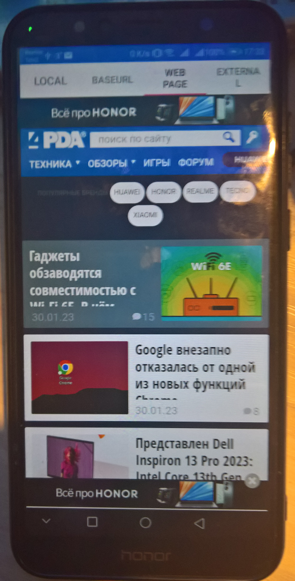

# 4PDAClientX
Another attempt to recover discontinued [4PDAClient app](https://www.microsoft.com/ru-ru/p/4pdaclient/9nblggh0ggvj).

## About
Simple multi-platform (Xamarin Forms) app to display 4PDA web site on "winphone" with Windows 10 Mobile.

Developers, feel free to use it as sample relate to the Working with WebView in Xamarin.Forms doc (UI) !

## Screenshots

## Tech/dev details
- Platforms: UWP, AnDroid, and iOS included :)
- Targets: ARM
- OSes: Windows 10 Mobile (os build: 10240 or above)

## Status
- Draft. Prototype / Alpha version.
- "Web parsing" not realized yet 
- "Astoria" compatibility added (os build 10240)

## Credits / Thanks
- [Working with WebView in Xamarin.Forms](https://docs.microsoft.com/xamarin/xamarin-forms/user-interface/webview?tabs=macos)  for very 
  handy & useful docs/samples!

## ..
AS IS. No support. RnD only / DIY

## .
[m][e] 2023

